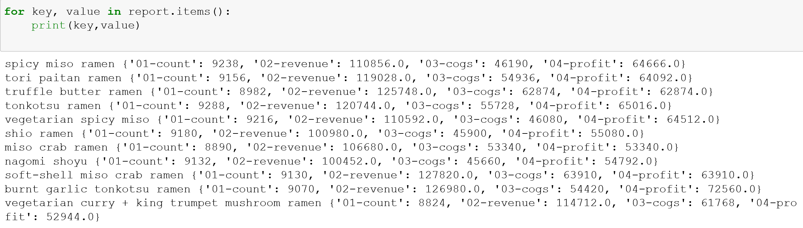

# python-sales-analysis

This project was an opportunity to analyze a business' financial performance by cross-referencing sales data with menu data from two separate CSVs.  One of the main goals of the analysis was to assess how each menu item was performing and to see which items if any need to be removed or changed.  I utilized Python for the analysis and was able to obtain:

- The total quantity for each ramen type
- The total revenue for each ramen type
- The total cost of goods sold for each ramen type
- The total profit for each ramen type

The output was:

